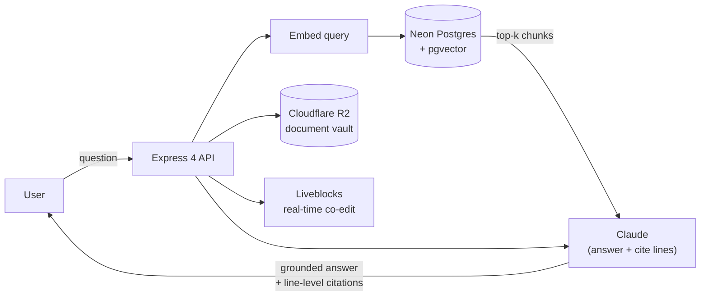

# ⚖️ LexVault

> **One-liner:** AI-powered contract lifecycle management — draft, review, analyze, sign, and collaborate on legal documents with **line-level citation grounding**.

**Repos:** `/Users/shivanshgupta/lexvault` (primary) · `/Users/shivanshgupta/lexvault-1` (mirror)

## Stack
- **Monorepo:** pnpm workspaces
- **Frontend:** Next.js 14
- **Backend:** Express 4
- **DB:** Neon PostgreSQL + **pgvector** (hybrid RAG)
- **AI:** Anthropic Claude (primary engine), `claude-sonnet-4-6` for web search
- **Editor:** BlockNote (Tiptap-based)
- **Storage:** Cloudflare R2
- **Real-time:** Liveblocks (co-editing)
- **Auth:** JWT RS256 (rotating refresh tokens) + Google OAuth

## Architecture — hybrid RAG with citations

## Core surface
- **Contract CRUD** — rich editor (BlockNote/Tiptap)
- **Templates** — NDA, Vendor Agreement, Consulting, Employment, MSA
- **Clause Library** — browse, search, insert
- **Variables** — `{{placeholders}}` detection and inline fill
- **Lifecycle:** `draft → reviewed → pending → signed` and `reviewing → finalized`
- **Version history** — block-level via PostgreSQL triggers
- **Export** — PDF, DOCX, Markdown, HTML

## AI features
- **Chat with Contract** — answers grounded with **exact line-level citations**
- **AI Review** — risks, missing clauses, inconsistencies (severity-graded)
- **Rewrite** — tone adjust (formal / friendly / concise)
- **Explain Clause** — plain-language breakdown
- **Summarize** — parties, obligations, key terms
- **Generate Clause** — from natural-language prompt
- **Suggest Clauses** — recommend missing, ready to insert
- **Generate Contract** — stream full contract from prompt
- **Web Search** — `claude-sonnet-4-6` with `web_search` tool
- **Intent Classification** — auto-detect contract type / domain

## Platform features
- RBAC + permissions
- Sharing (email invite or link, per-role permissions)
- Digital signatures (request + collect with embed metadata)
- Vault (hierarchical doc storage on R2)
- Workflows — DAG-based with approval gates
- Real-time collaboration (Liveblocks)
- Notifications
- Dashboard (metrics + activity feed)
- Audit log (365-day retention)
- Usage quotas (per-user, tier-based, daily/monthly resets)

## Audit + planning docs in repo root
- `API_CALLS_AUDIT.md`
- `API_OPTIMISATION_PLAN.md`
- `BACKEND_AUDIT_16MAY.md`
- `COMMUNITY_FEATURE_PLAN.md`
- `legal_rag_optimized_v2.json`

## Sources
- README: `/Users/shivanshgupta/lexvault/README.md`
- Deploy config: `/Users/shivanshgupta/lexvault/render.yaml`

## Connections
- [[Projects MOC]]
- Compares to: [[Arth Saathi]] — both use [[Confirm before write — AI mutations need human approval]] pattern for AI mutations
